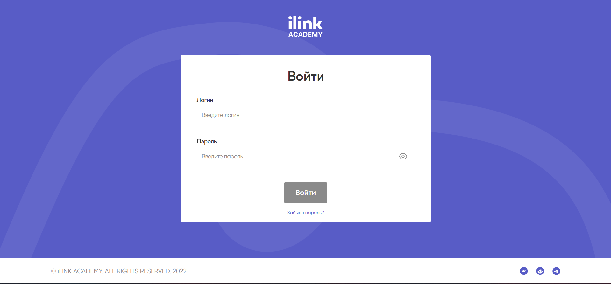
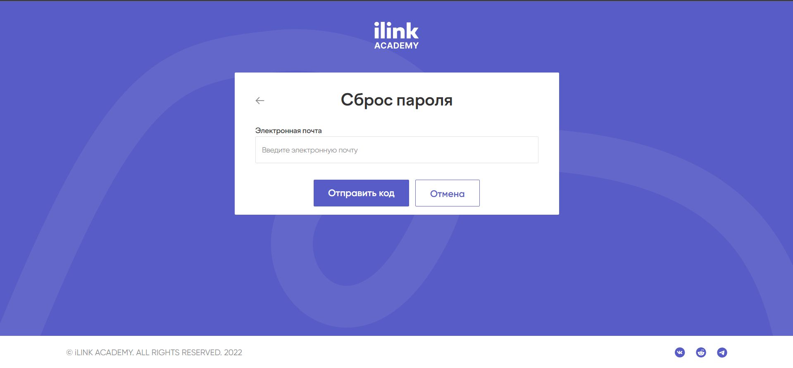
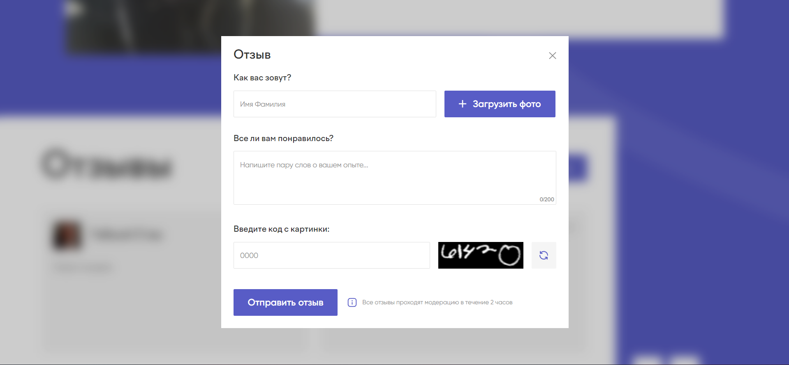
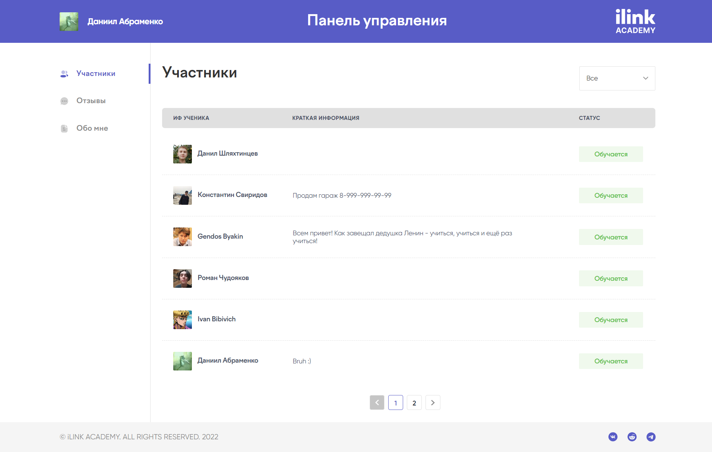
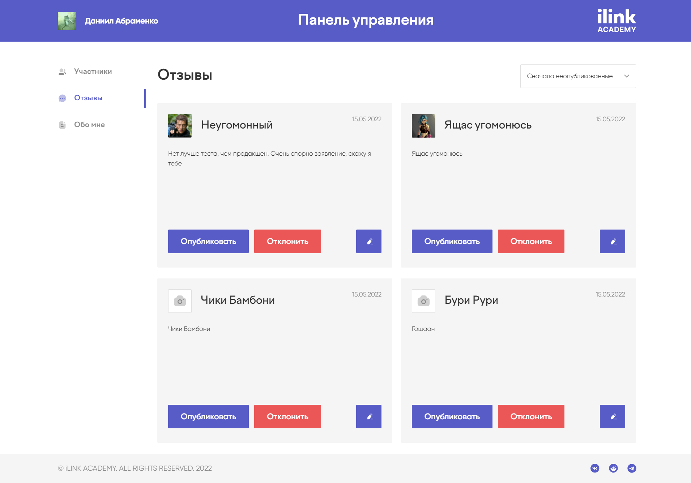
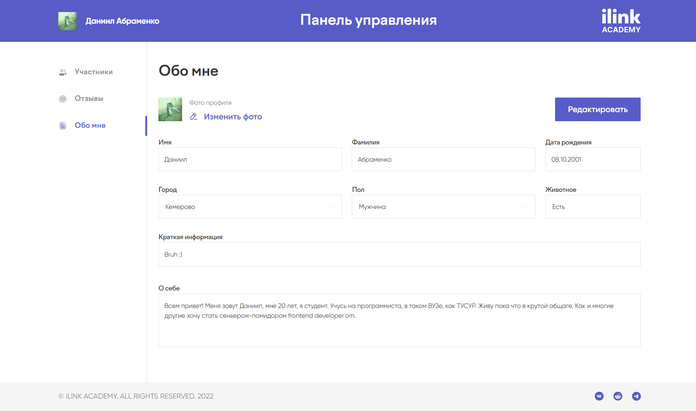
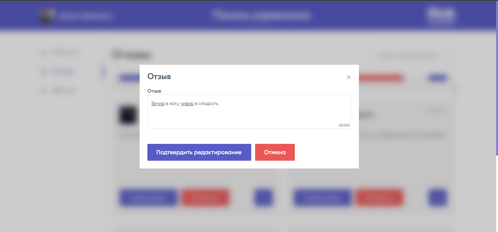
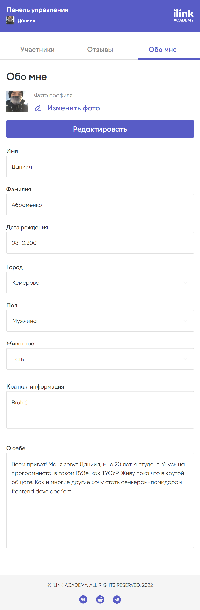

# Minuteman

#### This name was created in order not to disclose the secrecy of the project.

<h1>📱 Functional</h1>

***

* #### Authorization
* #### Editing your profile
* #### Changing the status and text of the reviews
* #### Viewing, adding and filtering reviews
* #### Viewing and filtering members
* #### Displaying information about a person in landing

***

<h1> 📰 Screenshots</h1>

***

## Authorization

***



## Landing

***


## Modal for adding reviews

***


## Users list

***


## Reviews list

***


## Profile

***


## Modal for editing review

***


## ☎️ Mobile

***





***
<h1>💿 Install Now</h1>

***
To start

```
yarn install
```

And repeat

```
yarn dev
```

<h1>🔧 Stack technologies</h1>

***

* [React](https://ru.reactjs.org/) - main UI library
* [TypeScript](https://www.typescriptlang.org/) - programming language
* [Effector](https://effector.dev/) - magical thing to work with BLL
* [SCSS](https://sass-scss.ru/) - css preprocessor
* [Feature-Sliced Design](https://feature-sliced.design/en/) - architectural methodology for frontend projects

<h1>🔒 License</h1>

***

Copyright (c) 2022 Abramenko Daniil.

This project is provided as is without any warranties. Use at your own risk.